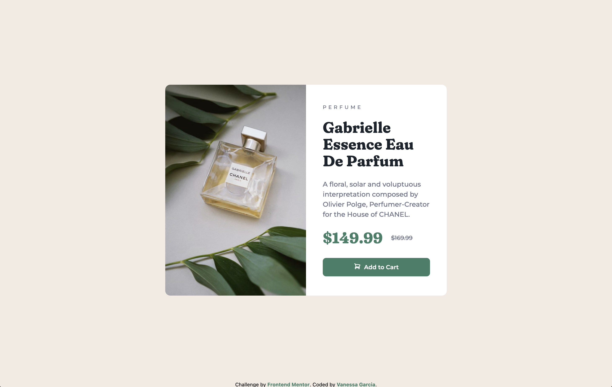

# Frontend Mentor - Product preview card component solution

This is a solution to the [Product preview card component challenge on Frontend Mentor](https://www.frontendmentor.io/challenges/product-preview-card-component-GO7UmttRfa). Frontend Mentor challenges help you improve your coding skills by building realistic projects.

## Table of contents

- [Overview](#overview)
  - [The challenge](#the-challenge)
  - [Screenshot](#screenshot)
  - [Links](#links)
- [My process](#my-process)
  - [Built with](#built-with)
  - [What I learned](#what-i-learned)
- [Author](#author)

## Overview

### The challenge

Users should be able to:

- View the optimal layout depending on their device's screen size
- See hover and focus states for interactive elements

### Screenshot

##### Desktop



##### Mobile


### Links

- Live Site URL: [Demo](https://petrihcour.github.io/product-preview-card/)

## My process

### Built with

- Semantic HTML5 markup
- CSS custom properties
- Flexbox
- Mobile-first workflow
- [Tailwind CSS](https://tailwindcss.com/) - CSS Framework

### What I learned

I learned how to utilize `flex-grow` and `flex-1` to make my containers and the content within them responsive.

```html
<main class="flex-grow flex justify-center items-center p-4">
  <div
    class="flex flex-col md:flex-row justify-center self-center bg-white rounded-xl max-w-2xl lg:w-2/4"
  >
    

    

    <div
      class="p-6 md:p-10 md:flex-1 md:flex md:flex-col md:justify-center"
    ></div>
  </div>
</main>
```

## Author

- Website - [Vanessa Garcia](https://vanessagarcia.netlify.app/)
- Frontend Mentor - [@petrihcour](https://www.frontendmentor.io/profile/petrihcour)